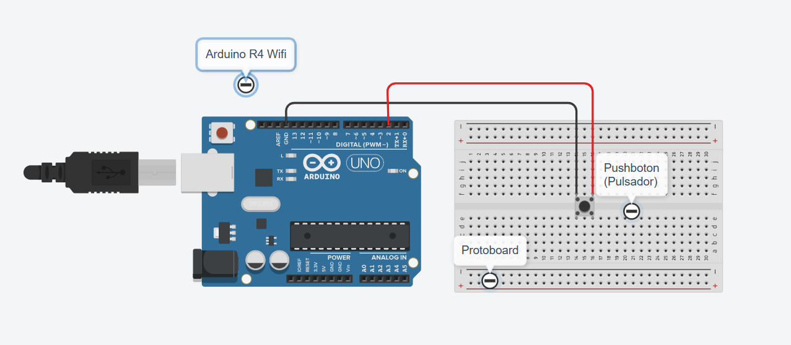
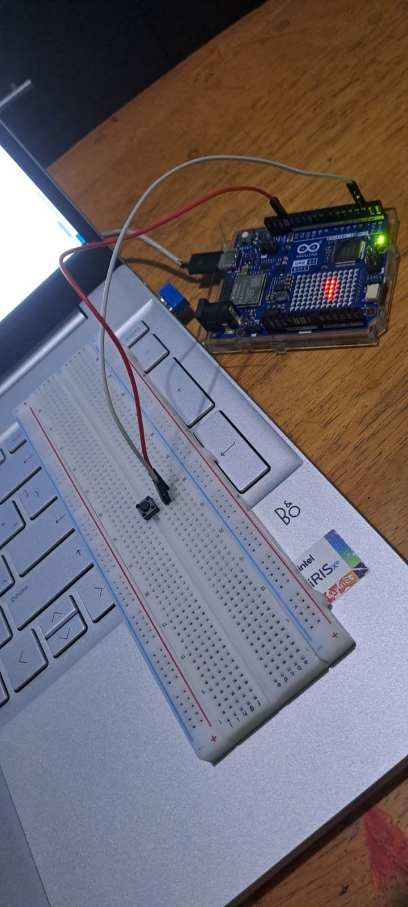

# Buffer Circular con Arduino

## Descripción

Esta práctica consiste en registrar las pulsaciones de un botón mediante un buffer circular en un Arduino UNO R4 WiFi.

El programa almacena los eventos en un arreglo de 32 posiciones y los muestra en el Monitor Serie. Mientras se procesan, la matriz LED integrada mantiene una animación en movimiento.

## Objetivos

- Comprender el funcionamiento de un buffer circular.
- Registrar pulsaciones mediante interrupciones.
- Utilizar antirrebote para evitar registros repetidos.
- Almacenar y procesar eventos sin detener otras tareas.
- Mostrar los eventos en el Monitor Serie y una animación en la matriz LED.

## Herramientas y material utilizado

- Arduino UNO R4 WiFi.
- Arduino IDE.
- Push button.
- Cables Dupont.
- Cable USB-C.
- Matriz LED integrada del Arduino.

## Diagrama

El diagrama muestra la conexión del pulsador al pin D2 y a GND del Arduino.

[Ver carpeta Diagramas](diagrama/)

## Código

El programa registra las pulsaciones mediante una interrupción y guarda sus tiempos en un buffer circular de 32 posiciones.

Utiliza `micros()` para registrar los eventos, un antirrebote de 40 ms y `millis()` para actualizar la animación de la matriz LED cada 100 ms.

[Ver código](codigo/Buffer_Circular1.ino)

## Reporte

El reporte contiene el procedimiento de la práctica, los resultados, las evidencias del circuito y las observaciones sobre el comportamiento del sistema.

[Ver reporte](reporte/Reporte_Practica_Buffer_Circular.pdf)

## Resultados

Cada pulsación válida se almacena en el buffer y después aparece en el Monitor Serie con un número consecutivo y su tiempo en microsegundos.

La matriz LED continúa mostrando una línea en movimiento mientras se procesan los eventos. Si el buffer se llena, el programa cuenta los nuevos eventos que no pudieron almacenarse.

## Video

El video muestra el funcionamiento del pulsador, el registro de eventos en el buffer circular y la animación de la matriz LED.

[Ver video](https://youtu.be/Lg2vXyP2IQk)

[Ver carpeta Video](video/)

## Conclusiones

La práctica permitió comprender cómo almacenar temporalmente las pulsaciones de un botón y procesarlas después mediante un buffer circular.

El uso de interrupciones permite registrar los eventos mientras el Arduino continúa ejecutando la animación de la matriz LED.
