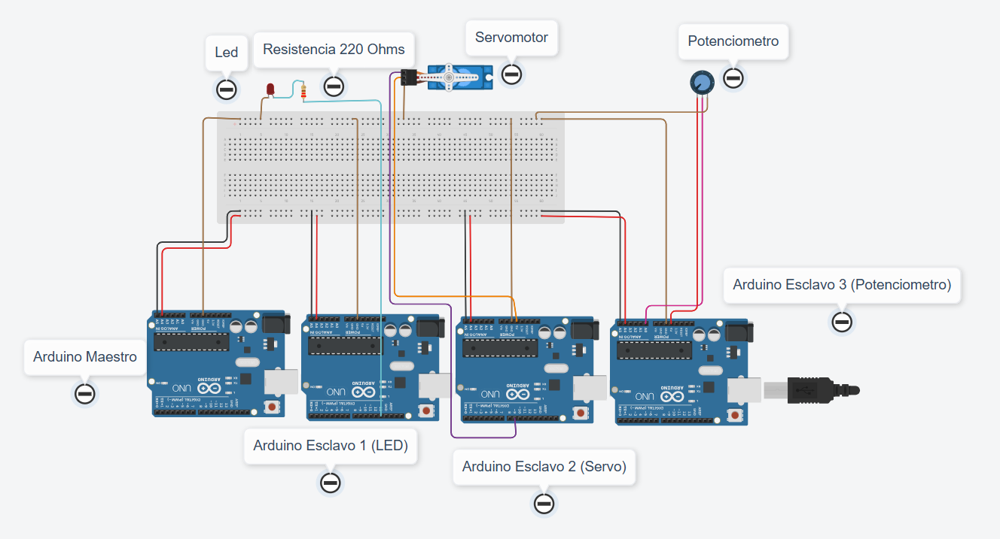
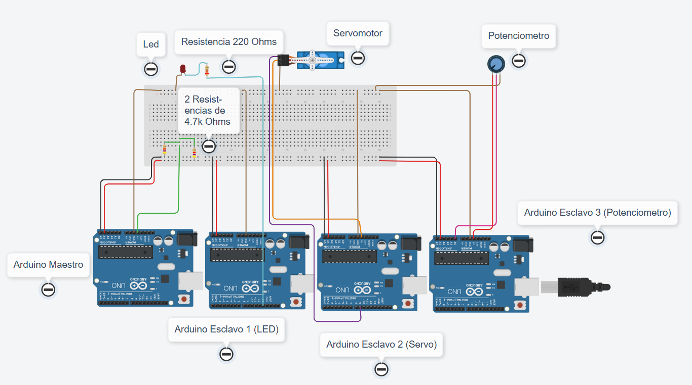
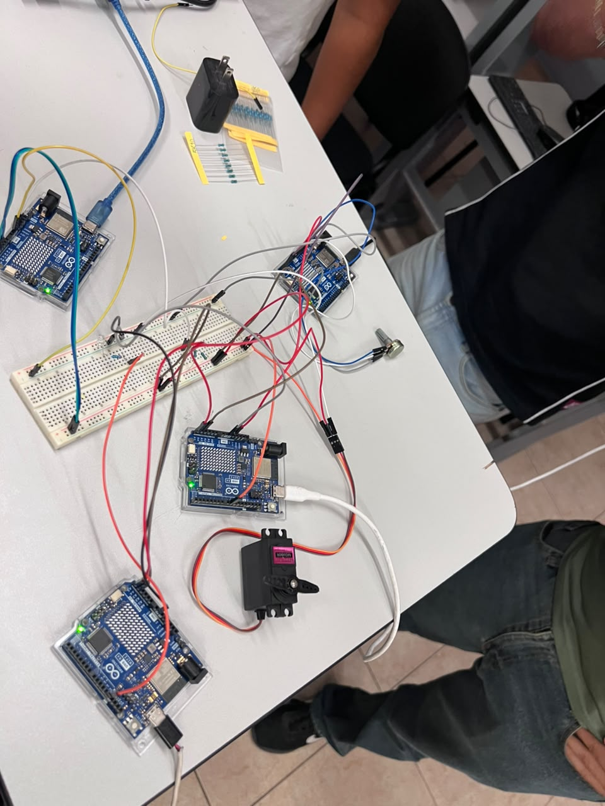

# Comunicación I2C entre 4 Arduinos

## Descripción

Esta práctica consiste en comunicar cuatro placas Arduino mediante el protocolo I2C: un maestro y tres esclavos encargados de controlar un LED, mover un servomotor y leer un potenciómetro.

El maestro envía órdenes para encender o apagar el LED desde el Monitor Serie. Además, solicita el valor del potenciómetro cada 500 ms, lo convierte en un ángulo de 0° a 180° y lo envía al Arduino que controla el servomotor.

## Objetivos

- Comprender la comunicación I2C entre un maestro y varios esclavos.
- Enviar órdenes desde el maestro para controlar un LED.
- Leer un potenciómetro y transmitir su valor mediante I2C.
- Utilizar el valor recibido para controlar la posición de un servomotor.
- Observar los datos de la comunicación en el Monitor Serie.

## Herramientas y material utilizado

- Cuatro placas Arduino y sus cables USB.
- Arduino IDE.
- Servomotor.
- Potenciómetro.
- LED del Arduino esclavo 1 (pin 13).
- Protoboard y cables de conexión.
- Computadora con Monitor Serie.

## Diagrama

El diagrama muestra las conexiones entre el Arduino maestro, los tres esclavos y los componentes utilizados para la comunicación I2C.

| Diagrama en Tinkercad | Conexiones físicas |
|:---:|:---:|
|  |  |

**Montaje del circuito**

  

[Ver carpeta Diagramas](Diagrama/)

## Código

El maestro utiliza la librería `Wire` para comunicarse con los esclavos mediante las direcciones I2C `0x08` (LED), `0x09` (servomotor) y `0x0A` (potenciómetro).

El esclavo del LED recibe las órdenes de encendido y apagado. El esclavo del potenciómetro envía su lectura en dos bytes y el esclavo del servomotor recibe el ángulo que debe aplicar.

[Ver código del maestro](Codigo/Maestro.ino)

[Ver código del esclavo 1: LED](Codigo/Esclavo1_LED.ino)

[Ver código del esclavo 2: Servomotor](Codigo/Esclavo2_Servomotor.ino)

[Ver código del esclavo 3: Potenciómetro](Codigo/Esclavo3_Potenciometro.ino)

## Reporte

El reporte reúne el procedimiento de la práctica, las conexiones del circuito, la explicación de la comunicación I2C y las evidencias del funcionamiento del sistema.

[Ver reporte](Reporte/Reporte_Comunicaci%C3%B3n_I2C_entre_4Arduinos.pdf)

## Resultados

Durante la práctica se implementó la comunicación entre un Arduino maestro y tres esclavos mediante el protocolo I2C. Cada esclavo tiene una dirección diferente, lo que permite al maestro enviar órdenes o solicitar información al dispositivo correspondiente.

Desde el Monitor Serie, el maestro puede recibir las órdenes `1` y `0` para indicar al esclavo 1 que encienda o apague el LED. Esta parte del programa muestra cómo enviar una instrucción desde una placa Arduino a otra sin conectar el LED directamente al maestro.

Cada 500 ms, el maestro solicita al esclavo 3 la lectura del potenciómetro. El valor recibido se reconstruye a partir de dos bytes, se convierte en un ángulo de 0° a 180° y se envía al esclavo 2 para indicar la posición del servomotor.

La captura del Monitor Serie sirve como evidencia del intercambio de valores entre las placas. En conjunto, la práctica muestra cómo distribuir tareas entre varios Arduinos y coordinar el control de los componentes mediante un mismo bus de comunicación.

## Video

El video presenta el montaje y el funcionamiento de la comunicación I2C entre los cuatro Arduinos durante la práctica.

[Ver video](https://youtu.be/rPVRqIlCSFY?si=1B2Z4G6kzqzJozj-)

[Ver carpeta Video](Video/)

## Conclusiones

La práctica permitió comprender cómo cuatro placas Arduino pueden comunicarse mediante I2C y repartir distintas funciones entre un maestro y varios esclavos. El maestro organiza las solicitudes y envía las instrucciones a cada dispositivo mediante su dirección correspondiente.

También se aplicó la lectura de un potenciómetro, el envío de datos en dos bytes y la conversión de esos valores en ángulos para controlar un servomotor. El Monitor Serie ayudó a observar los datos intercambiados y a relacionar la programación con el comportamiento del circuito.

En conjunto, la práctica mostró la utilidad de la comunicación I2C para conectar varios dispositivos y coordinar sus tareas sin que todos los componentes tengan que estar conectados directamente al Arduino maestro.
