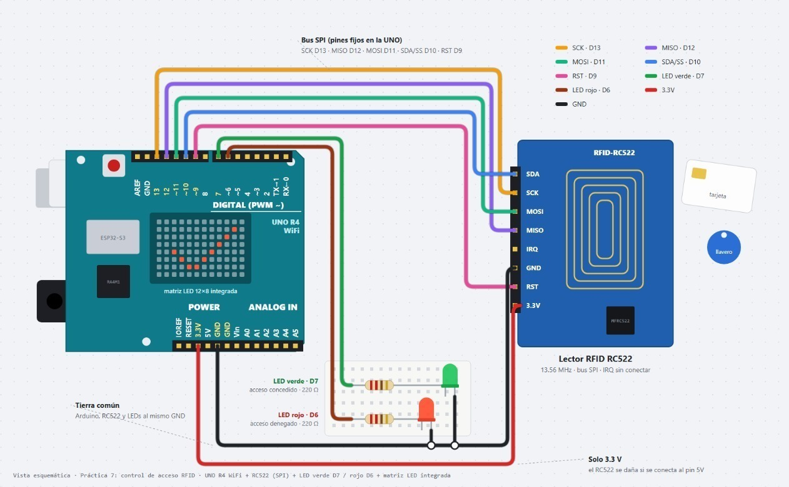
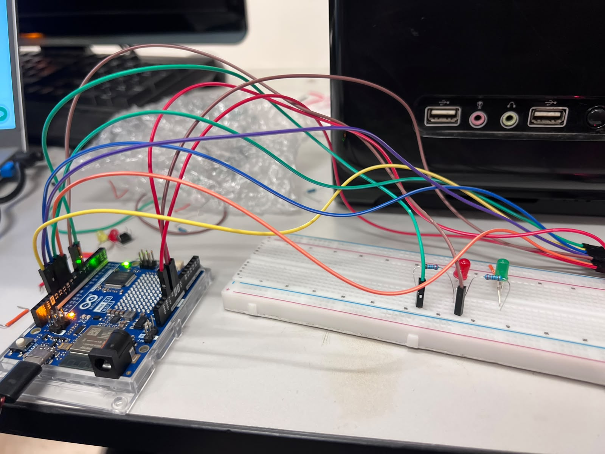
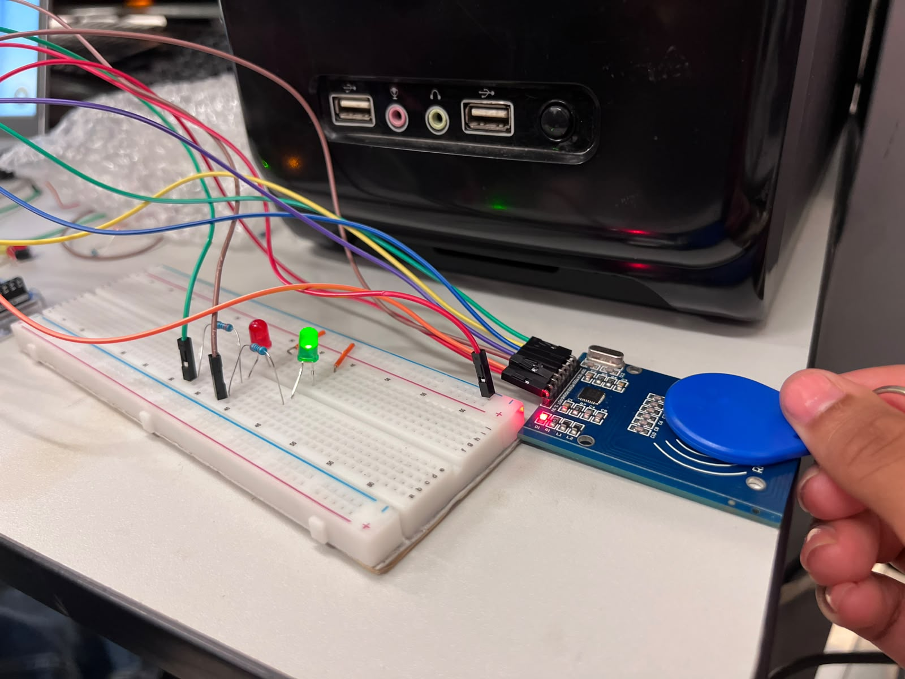

# Control de acceso con RFID por SPI

## Descripción

Esta práctica consiste en implementar un control de acceso utilizando un lector RFID RC522 conectado a un Arduino UNO R4 WiFi mediante el protocolo SPI.

El sistema lee el UID de una tarjeta o llavero RFID y lo muestra en el Monitor Serie. Después compara ese identificador con un UID autorizado guardado en el programa para decidir si el acceso debe permitirse o rechazarse.

## Objetivos

- Comprender la comunicación SPI entre el Arduino y el lector RFID RC522.
- Leer y mostrar el UID de tarjetas o llaveros RFID.
- Comparar el UID leído con un identificador autorizado.
- Encender un LED verde cuando el acceso es permitido.
- Encender un LED rojo cuando el acceso es denegado.
- Mostrar el resultado de cada lectura en el Monitor Serie.

## Herramientas y material utilizado

- Arduino UNO R4 WiFi.
- Arduino IDE.
- Lector RFID RC522.
- Tarjeta y llavero RFID.
- LED verde y LED rojo.
- Resistencias para los LEDs.
- Protoboard y cables de conexión.
- Cable USB.

## Diagrama

El diagrama muestra la conexión del lector RFID RC522 con el Arduino mediante SPI, además de los LEDs utilizados para indicar si el acceso es permitido o denegado.

### Diagrama de conexiones

  

### Montaje físico

  

  

[Ver carpeta Diagramas](Diagrama/)

## Código

El programa utiliza las librerías `SPI` y `MFRC522` para comunicarse con el lector RFID. Al iniciar, verifica que exista comunicación con el RC522 y muestra el estado del lector en el Monitor Serie.

Cada tarjeta detectada muestra su UID en hexadecimal. El programa compara ese valor con el UID autorizado `99 EB 7B 63`; si coincide, enciende el LED verde y muestra **ACCESO PERMITIDO**. Si no coincide, enciende el LED rojo y muestra **ACCESO DENEGADO**.

Los LEDs permanecen encendidos durante 2 segundos y después se apagan utilizando `millis()`, sin bloquear la lectura del sistema.

[Ver código](Codigo/control_acceso_rfid.ino)

## Reporte

El reporte reúne el procedimiento de la práctica, las conexiones del lector RFID, la comunicación mediante SPI, las pruebas de lectura y las evidencias del funcionamiento del control de acceso.

[Ver reporte](Reporte/Reporte_Control_Acceso_RFID.pdf)

## Resultados

Durante las pruebas, el Arduino logró comunicarse con el lector RFID RC522 mediante el bus SPI. Al iniciar el programa, el Monitor Serie muestra la versión detectada del lector y confirma si existe comunicación correctamente antes de comenzar a leer tarjetas.

Cada vez que se acerca una tarjeta o llavero, el programa obtiene su UID y lo muestra en formato hexadecimal. Esto permite identificar cada dispositivo RFID y utilizar uno de esos valores como referencia para autorizar el acceso.

El programa tiene configurado como autorizado el UID `99 EB 7B 63`. Cuando el UID leído coincide con ese valor, el sistema muestra **ACCESO PERMITIDO** y enciende el LED verde durante 2 segundos. Cuando se presenta un UID diferente, muestra **ACCESO DENEGADO** y enciende el LED rojo durante el mismo tiempo.

Además, el programa revisa periódicamente que el lector continúe respondiendo. Esta comprobación ayuda a detectar una pérdida de comunicación o un reinicio del RC522 y permite observar con mayor claridad el funcionamiento del sistema durante las pruebas.

### Evidencia en el Monitor Serie

  

## Video

El video muestra el montaje del circuito, la lectura de las tarjetas RFID y la respuesta del sistema al detectar un acceso autorizado o no autorizado.

[Ver video](https://youtu.be/o6up5xnkzOA?si=dYZBjHPmNA9fu-W4)

[Ver carpeta Video](Video/)

## Conclusiones

La práctica permitió comprender cómo utilizar el protocolo SPI para comunicar un Arduino UNO R4 WiFi con un lector RFID RC522. Mediante esta comunicación fue posible leer el UID de diferentes tarjetas y utilizar ese identificador como base para un sistema sencillo de control de acceso.

También se aplicó una comparación entre el UID leído y un valor autorizado almacenado en el programa. Dependiendo del resultado, el sistema informa si el acceso está permitido o denegado y utiliza los LEDs verde y rojo como indicadores visuales.

El Monitor Serie fue útil para comprobar la comunicación con el lector, visualizar los UID y observar la respuesta del programa durante cada prueba. En conjunto, la práctica permitió relacionar la comunicación SPI, la identificación RFID y el control de salidas digitales dentro de una misma aplicación.
