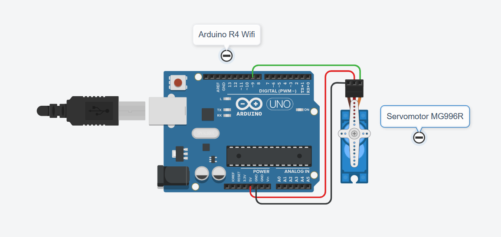
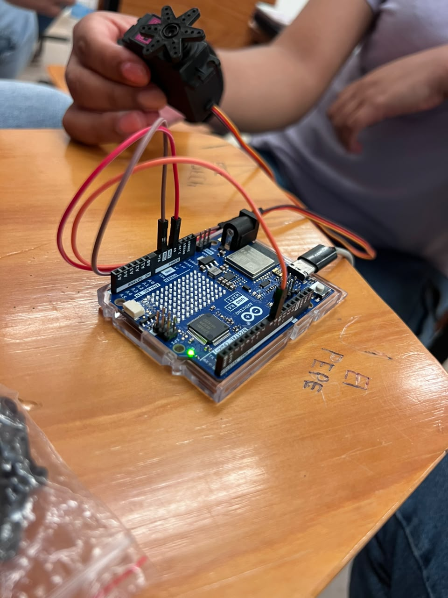
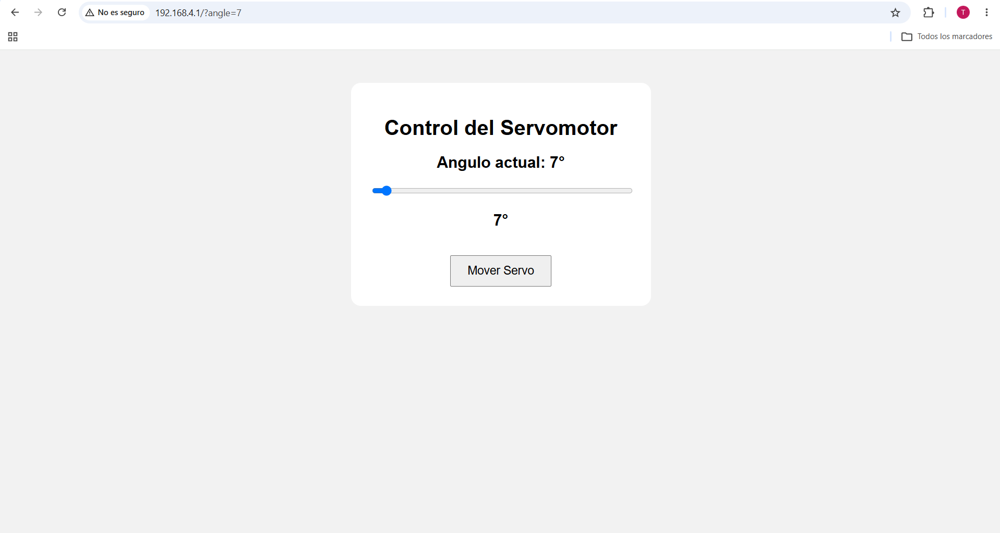
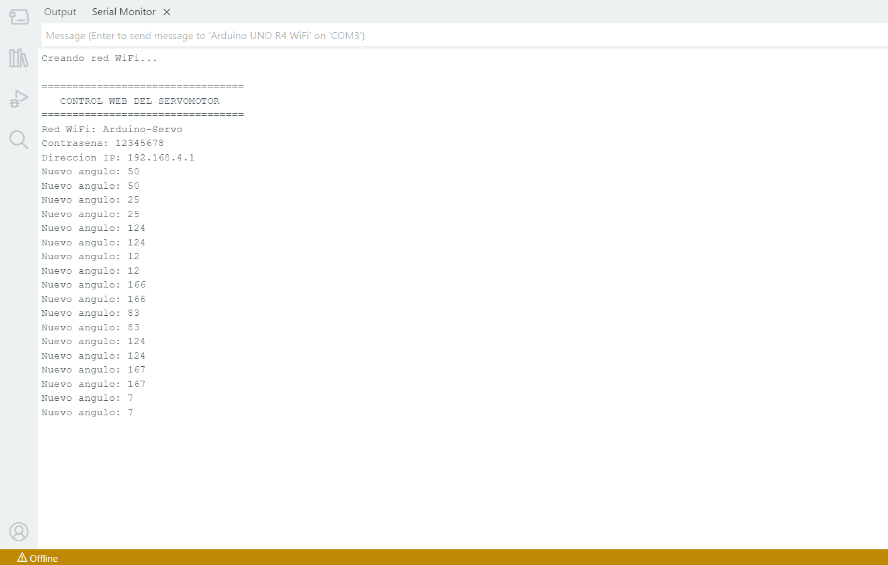

# Control de Servomotor por Interfaz Web

## Descripción

Esta práctica consiste en controlar la posición de un servomotor MG996R desde una página web mediante un Arduino UNO R4 WiFi.

El Arduino crea una red Wi-Fi llamada **Arduino-Servo** y muestra una página con una barra deslizante para seleccionar un ángulo de 0° a 180°. Al enviar el valor, el servomotor se posiciona en el ángulo solicitado.

## Objetivos

- Controlar un servomotor desde una interfaz web.
- Utilizar el Arduino UNO R4 WiFi como servidor web.
- Seleccionar y enviar ángulos de 0° a 180°.
- Recibir datos mediante peticiones HTTP.
- Mostrar los ángulos recibidos en el Monitor Serie.

## Herramientas y material utilizado

- Arduino UNO R4 WiFi.
- Arduino IDE.
- Servomotor MG996R de 180°.
- Cables Dupont.
- Cable USB-C.
- Computadora o teléfono con navegador web.

## Diagrama

El diagrama muestra las conexiones del servomotor con el Arduino. La señal de control se conecta al pin D9.

[Ver carpeta Diagramas](diagrama/)

## Código

El programa crea una red Wi-Fi y una página web para seleccionar el ángulo del servomotor.

Utiliza las librerías `WiFiS3` y `Servo`. Al recibir un ángulo válido, utiliza `servo.write()` para posicionar el servomotor.

[Ver código](codigo/CSW.ino)

## Reporte

El reporte contiene el procedimiento de la práctica, las evidencias del circuito, los resultados y las observaciones sobre el funcionamiento del sistema.

[Ver reporte](reporte/Reporte_Practica_Servomotor_Interfaz_Web.pdf)

## Resultados

Durante las pruebas se enviaron diferentes ángulos desde la interfaz web creada por el Arduino UNO R4 WiFi. La página permitió seleccionar la posición deseada mediante una barra deslizante y enviar la orden con el botón para mover el servomotor.

El Monitor Serie registró los valores recibidos durante las pruebas, entre ellos 50°, 25°, 124°, 12° y 166°. Estos registros muestran que el programa recibió distintos valores enviados desde el navegador mediante la conexión Wi-Fi.

La interfaz permite seleccionar ángulos dentro del rango de 0° a 180°. El programa comprueba ese rango antes de utilizar `servo.write()` para indicar la posición solicitada al servomotor.

Las capturas de la página web y del Monitor Serie sirven como evidencia del envío y la recepción de los ángulos, así como de la interacción entre la interfaz y el Arduino.

## Video

El video muestra el control del servomotor desde la página web y el envío de ángulos al Arduino.

[Ver video](https://youtu.be/AtDGY__b80o)

[Ver carpeta Video](video/)

## Conclusiones

La práctica permitió utilizar el Arduino UNO R4 WiFi como servidor web para controlar un servomotor MG996R desde un navegador. La interfaz facilitó seleccionar un ángulo y enviar la orden sin utilizar una aplicación adicional.

Mediante las peticiones HTTP, el Arduino recibe el valor seleccionado y lo utiliza para indicar la posición del servomotor. El Monitor Serie permitió observar los diferentes ángulos recibidos durante las pruebas y comprobar la comunicación entre la página y el programa.

En conjunto, la práctica relacionó la programación de una interfaz web con el control de un componente físico mediante Wi-Fi.

