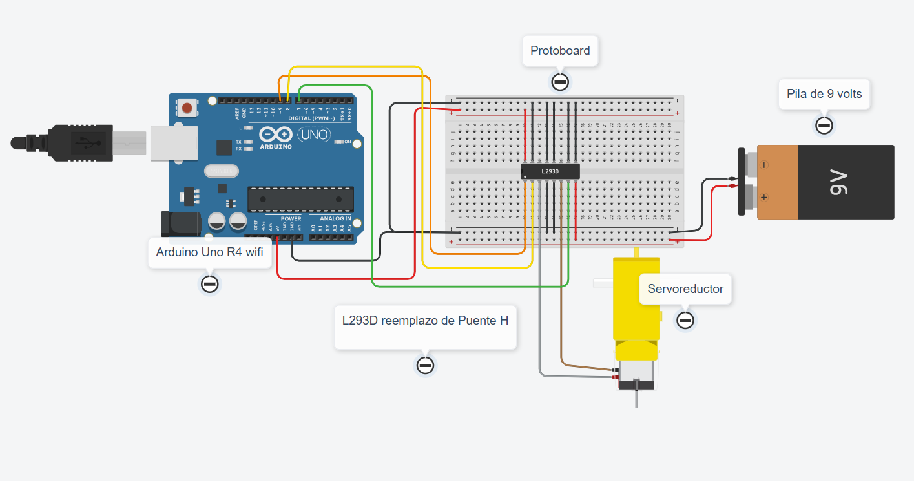

# Control por voz con Arduino

Encendido de un LED y una matriz LED, y control de un motorreductor en tres velocidades.

## Descripción

Aplicación creada en **MIT App Inventor** que envía comandos de voz por Wi-Fi a un **Arduino UNO R4 WiFi** para encender y apagar un LED y la matriz integrada, además de controlar el avance, retroceso y paro de un motorreductor.

## Objetivos de aprendizaje

Utilizar comandos de voz para controlar dispositivos con Arduino, comunicar una aplicación mediante Wi-Fi y programar tres niveles de velocidad usando PWM y un puente H.

## Material utilizado

- Arduino UNO R4 WiFi y cable USB.
- Puente H L298N.
- Motorreductor con rueda.
- Batería Energizer Max de 9 V.
- Cables Dupont.
- Teléfono Android con MIT AI2 Companion.
- Computadora con Arduino IDE y conexión Wi-Fi.

## Diagrama del circuito

Representación en Tinkercad con Arduino UNO y L293D como referencia. En la práctica se utilizaron UNO R4 WiFi y L298N.

## Código

- [Programa de Arduino](Codigo/ControlPorVoz.ino).
- [Diseño y bloques de App Inventor](Codigo/AppInventor/).

El LED utiliza el pin **4**. El puente H utiliza **ENA = 9**, **IN1 = 8** e **IN2 = 7**.

## Video del funcionamiento

[Ver video en YouTube](https://youtu.be/HVi7jjqaD8g)

## Evidencias de armado

- [Representación del circuito](Diagrama/Tinkercad_CPV.png).
- [Diseño de la aplicación](Codigo/AppInventor/Dise%C3%B1o_App_CPV.png).
- [Pruebas en el Monitor Serie](Resultados/Monitor_Serial.png).

## Reporte

[Reporte de la práctica.pdf](Reporte/Reporte_Practica_Control_por_Voz.pdf)

Incluye:

- Objetivo, materiales y procedimiento.
- Gráficas y tablas de datos.
- Observaciones sobre el comportamiento del sistema.

## Conclusiones

La práctica permitió aprender a comunicar una aplicación con Arduino y controlar dispositivos mediante la voz. También ayudó a comprender el uso del puente H y del PWM. Durante las pruebas se observó que recibir un comando no garantiza que el motor se mueva, por lo que es necesario revisar las conexiones y la alimentación.

## Resultados

Se confirmó el encendido del LED y la matriz. El Monitor Serie mostró una IP válida y recibió las órdenes de avance en tres niveles y de paro. El funcionamiento físico del motor quedó pendiente de confirmar.

| Nivel | PWM |
|---|---|
| Detenido | 0 |
| Baja | 110 |
| Media | 180 |
| Máxima | 255 |

Estos valores corresponden al control programado, no a velocidades medidas.

- [Monitor Serie](Resultados/Monitor_Serial.png).
- [Resultados de la práctica.pdf](Resultados/ResultadosCPV.pdf).
