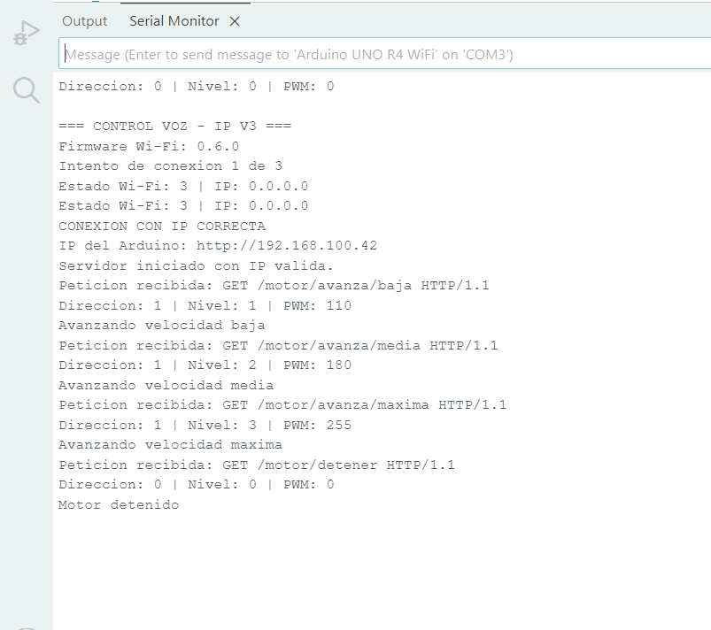

# Motor controlado por voz con Arduino

## Descripción

Esta práctica consiste en controlar un LED, la matriz LED integrada y un motorreductor mediante comandos de voz enviados desde una aplicación de MIT App Inventor a un Arduino UNO R4 WiFi.

El programa recibe las órdenes por Wi-Fi y permite detener el motor o seleccionar tres niveles de velocidad mediante PWM.

## Objetivos

- Controlar dispositivos mediante comandos de voz.
- Comunicar una aplicación con Arduino por Wi-Fi.
- Encender y apagar un LED y la matriz LED.
- Programar tres niveles de velocidad para un motorreductor.
- Utilizar un puente H y señales PWM para controlar el motor.

## Herramientas y material utilizado

- Arduino UNO R4 WiFi y cable USB.
- Arduino IDE.
- MIT App Inventor y teléfono Android.
- Puente H L298N.
- Motorreductor con rueda.
- Batería de 9 V.
- LED externo.
- Cables Dupont.
- Conexión Wi-Fi.

## Diagrama

El diagrama muestra una representación de las conexiones del circuito. La imagen de Tinkercad utiliza Arduino UNO y L293D como referencia del montaje.

[Ver carpeta Diagramas](Diagrama/)

## Código

El programa recibe las órdenes enviadas por la aplicación para controlar las luces y los niveles de velocidad del motor.

El control del motor utiliza PWM con valores de 0 (detenido), 110 (baja), 180 (media) y 255 (máxima).

[Ver código Arduino](Codigo/ControlPorVoz.ino)

[Ver archivos de App Inventor](Codigo/AppInventor/)

## Reporte

El reporte contiene el procedimiento de la práctica, las evidencias del circuito, las tablas de datos y las observaciones del sistema.

[Ver reporte](Reporte/Reporte_Practica_Control_por_Voz.pdf)

## Resultados

Durante las pruebas, la aplicación envió comandos de voz al Arduino UNO R4 WiFi y se confirmó el encendido y apagado del LED externo y de la matriz LED integrada. Esto permitió observar la comunicación entre la aplicación y el Arduino mediante la red inalámbrica.

El Monitor Serie mostró la conexión del Arduino a Wi-Fi y la recepción de órdenes de velocidad y paro. El programa está preparado para aplicar al motor los niveles PWM de 110, 180 y 255, además del valor 0 para detenerlo.

Las órdenes recibidas permiten comprobar la parte de comunicación y el control programado. Sin embargo, el movimiento físico del motorreductor quedó pendiente de confirmar, por lo que los valores PWM no representan velocidades medidas del motor.

Las evidencias del Monitor Serie documentan las órdenes procesadas durante la práctica y ayudan a distinguir el funcionamiento del programa del comportamiento físico del motor.

## Video

El video muestra la práctica de control por voz y el envío de órdenes desde la aplicación al Arduino.

[Ver video](https://youtu.be/HVi7jjqaD8g)

[Ver carpeta Video](Video/)

## Conclusiones

La práctica permitió comprender cómo una aplicación creada en MIT App Inventor puede enviar comandos de voz por Wi-Fi a un Arduino para controlar diferentes dispositivos. Las pruebas confirmaron la recepción de las órdenes y el funcionamiento del LED externo y la matriz integrada.

También se aplicó el uso de PWM y de un puente H para programar tres niveles de velocidad y una orden de paro para el motorreductor. El Monitor Serie permitió verificar los comandos recibidos y los valores enviados por el programa.

El movimiento físico del motor quedó pendiente de confirmar. Esto muestra la importancia de revisar tanto la comunicación y el código como las conexiones y la alimentación del circuito.

