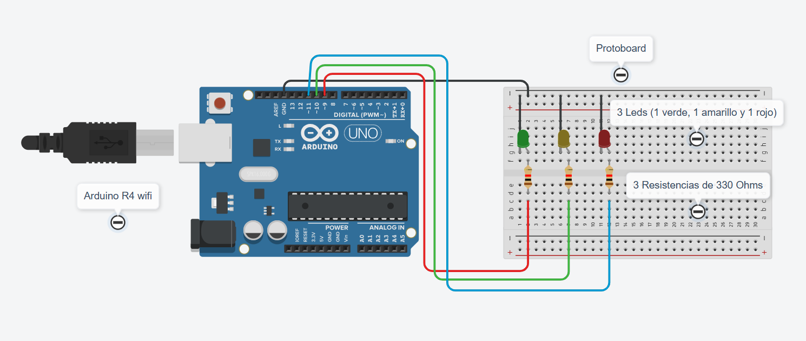
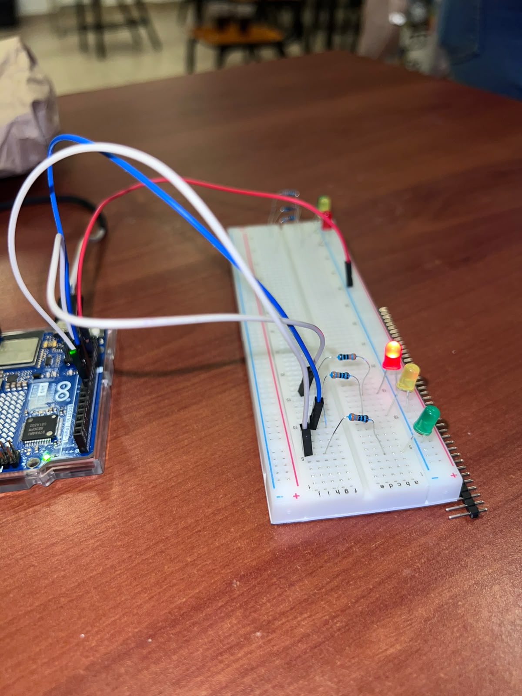
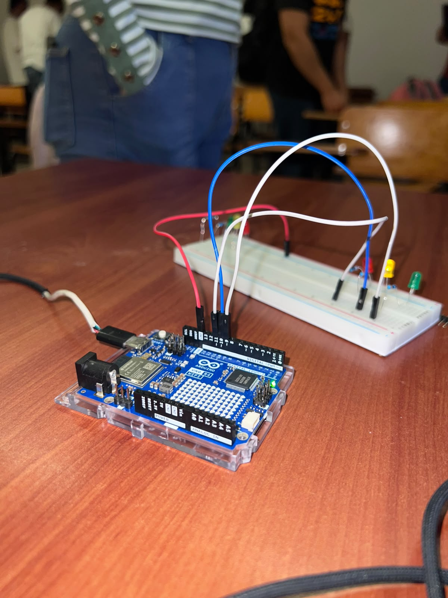
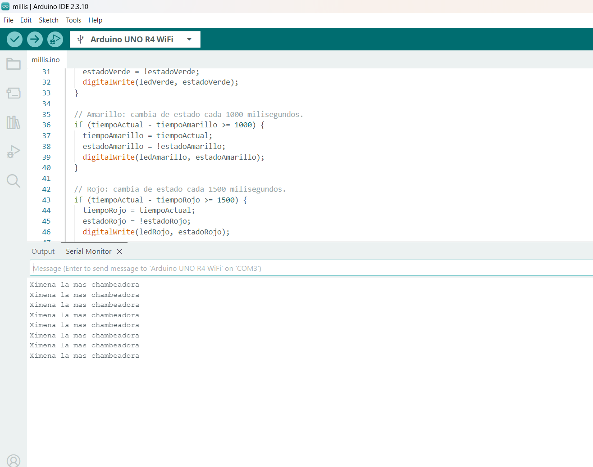

# Paradigmas de la Ejecución: delay() y millis()

## Descripción

Esta práctica compara dos formas de controlar el tiempo de encendido de tres LEDs con un Arduino UNO R4 WiFi: `delay()` y `millis()`.

Ambos programas utilizan el mismo circuito. Con `delay()`, los LEDs se encienden uno después de otro; con `millis()`, cada LED cambia de estado según su propio intervalo y se utiliza el Monitor Serie.

## Objetivos

- Comparar el funcionamiento de `delay()` y `millis()`.
- Controlar tres LEDs mediante salidas digitales.
- Identificar la diferencia entre una ejecución secuencial y una temporización no bloqueante.
- Utilizar el Monitor Serie para observar mensajes del programa con `millis()`.

## Herramientas y material utilizado

- Arduino UNO R4 WiFi.
- Arduino IDE.
- Protoboard.
- LED verde, amarillo y rojo.
- Resistencias y cables de conexión.
- Cable USB.
- Monitor Serie del Arduino IDE.

## Diagrama

El circuito utiliza tres LEDs conectados a los pines D9 (verde), D10 (amarillo) y D11 (rojo) del Arduino. El mismo montaje se utiliza para ambos programas.

[Ver carpeta Diagramas](Diagrama/)

## Código

El programa con `delay()` enciende los LEDs de forma secuencial durante 500 ms (verde), 1000 ms (amarillo) y 1500 ms (rojo). Cada espera detiene temporalmente la ejecución del programa.

El programa con `millis()` revisa el tiempo transcurrido y cambia el estado de cada LED de manera independiente. Cuando se enciende el LED rojo, también envía un mensaje al Monitor Serie a 9600 baudios.

[Ver código con delay()](Codigo/Delay.ino)

[Ver código con millis()](Codigo/millis.ino)

## Reporte

El reporte reúne la explicación del circuito, el procedimiento y la comparación entre ambas formas de controlar los tiempos de los LEDs.

[Ver reporte](Reporte/Reporte_ParadigamasdeEjecucion.pdf)

## Resultados

Con `delay()`, el programa enciende primero el LED verde durante 500 ms, después el amarillo durante 1000 ms y finalmente el rojo durante 1500 ms. Cada LED se apaga antes de que se encienda el siguiente, por lo que las acciones ocurren una después de otra.

Con `millis()`, los tres LEDs pueden cambiar de estado de forma independiente: el verde cada 500 ms, el amarillo cada 1000 ms y el rojo cada 1500 ms. Como el programa no espera a que termine un LED para revisar los demás, sus intervalos se controlan dentro del mismo ciclo de ejecución.

En la versión con `millis()`, el Monitor Serie muestra un mensaje cada vez que se enciende el LED rojo. Esto permite observar otra actividad del Arduino mientras continúa el control de las luces.

La comparación permite distinguir una secuencia con esperas mediante `delay()` de un programa que revisa el tiempo transcurrido mediante `millis()`. Aunque ambos usan el mismo circuito, el comportamiento de las luces y la forma de ejecutar las tareas son diferentes.

## Video

Los videos muestran el funcionamiento de los programas de la práctica con el circuito de tres LEDs.

[Ver video 1](https://youtu.be/zXMxCz9uoMA?si=Up6rGS999ETC38SV)

[Ver video 2](https://youtu.be/gIHIuMy8Fag?si=nVLI3jlfM2oAtlDP)

[Ver carpeta Video](Video/)

## Conclusiones

La práctica permitió comparar dos maneras de controlar los tiempos de un circuito con Arduino. Con `delay()`, las instrucciones se ejecutan de forma secuencial, ya que el programa espera a que termine cada intervalo antes de continuar con el siguiente LED.

En cambio, `millis()` permite revisar el tiempo transcurrido sin detener el ciclo principal. Así, cada LED puede cambiar de estado según su propio intervalo y el Arduino puede realizar otras tareas, como enviar mensajes al Monitor Serie.

En conjunto, la práctica permitió relacionar la programación con el comportamiento de los componentes físicos y comprender por qué la temporización no bloqueante resulta útil cuando un sistema necesita atender varias actividades durante su funcionamiento.
