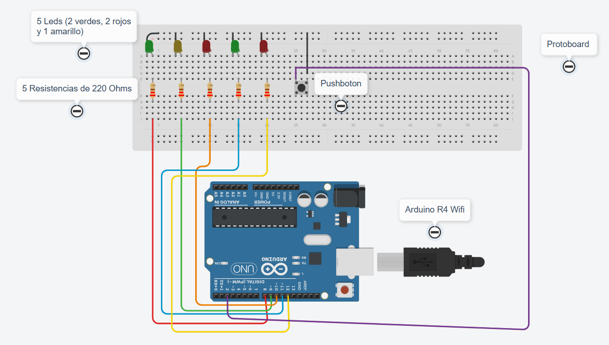
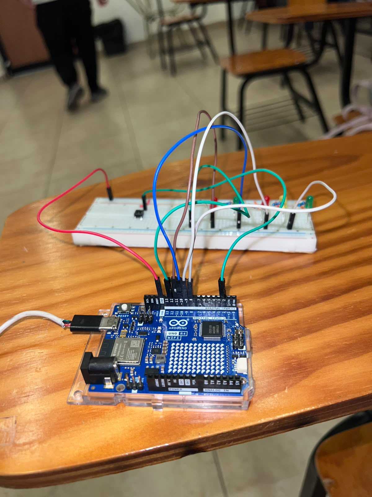

# Semáforo Vehicular y Peatonal con Arduino

## Descripción

Esta práctica consiste en controlar un semáforo vehicular y peatonal mediante un Arduino UNO R4 WiFi, cinco LEDs y un botón para solicitar el cruce.

El semáforo cambia de verde a amarillo y rojo. La solicitud del peatón se guarda y se atiende cuando los vehículos tienen la luz roja. Los tiempos se controlan con `millis()`, sin detener la lectura del botón.

## Objetivos

- Comprender el funcionamiento de un semáforo vehicular y peatonal.
- Controlar cinco LEDs mediante salidas digitales.
- Utilizar un botón para solicitar el cruce peatonal.
- Programar los tiempos del semáforo con `millis()`.
- Evitar lecturas repetidas del botón mediante antirrebote.
- Permitir el cruce peatonal cuando el semáforo vehicular está en rojo.

## Herramientas y material utilizado

- Arduino UNO R4 WiFi.
- Arduino IDE.
- Protoboard.
- 2 LEDs rojos, 2 verdes y 1 amarillo.
- Resistencias de 220 Ω.
- Push button.
- Cables Dupont.
- Cable USB-C.

## Diagrama

El diagrama muestra las conexiones del Arduino con los LEDs y el botón utilizados en la práctica.

[Ver carpeta Diagramas](diagrama/)

## Código

El programa controla la secuencia de luces del semáforo y guarda las solicitudes de cruce realizadas con el botón.

Utiliza `millis()` para controlar los tiempos: verde durante 6 segundos, amarillo durante 2 segundos y rojo durante 6 segundos.

[Ver código](codigo/Semaforo_Peatonal.ino)

## Reporte

El reporte contiene el procedimiento de la práctica, las evidencias del circuito, los resultados y las observaciones sobre el funcionamiento del sistema.

[Ver reporte](reporte/Reporte_Practica_Semaforo_Cruce_Peatonal.pdf)

## Resultados

El programa establece una secuencia vehicular de verde, amarillo y rojo con duraciones de 6, 2 y 6 segundos, respectivamente.

Al presionar el botón durante el verde o amarillo vehicular, la solicitud queda guardada. Cuando comienza el rojo vehicular, se enciende el verde peatonal; si no hay solicitud, el peatón permanece en rojo.

El antirrebote de 40 ms evita que una misma pulsación se registre varias veces.

## Video

El video muestra el funcionamiento del semáforo vehicular y peatonal, incluyendo la solicitud de cruce mediante el botón.

[Ver video](https://youtu.be/Fw5TZOuojWg?si=uEQRUvMrNa91d_S3)

[Ver carpeta Video](video/)

## Conclusiones

La práctica permitió aplicar el control de LEDs y la lectura de un botón para representar un semáforo vehicular y peatonal.

El uso de `millis()` permite mantener la lectura del botón mientras transcurren los tiempos del semáforo. La solicitud peatonal se atiende cuando los vehículos tienen la luz roja.
